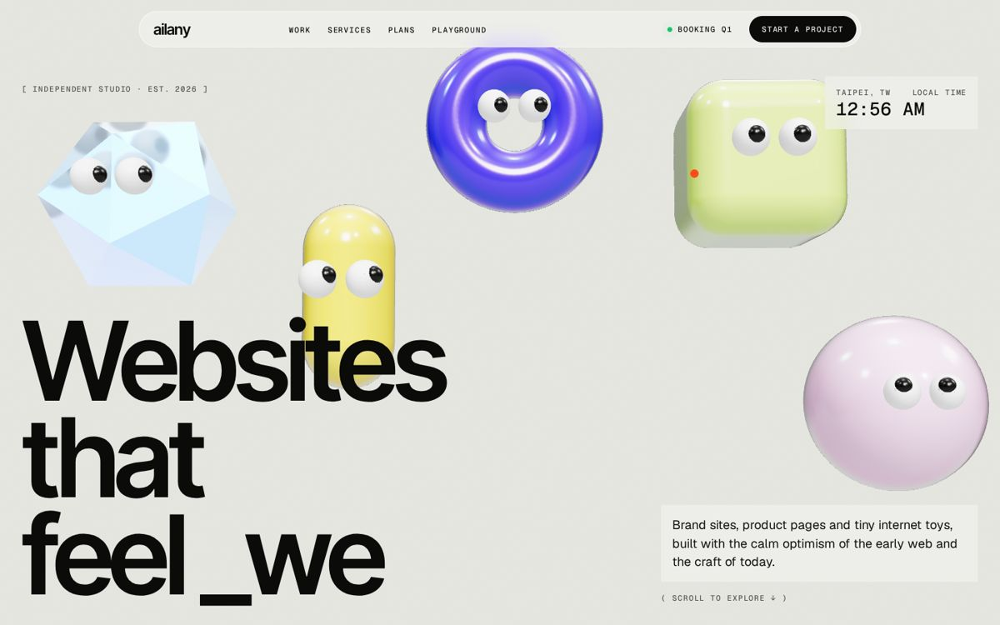
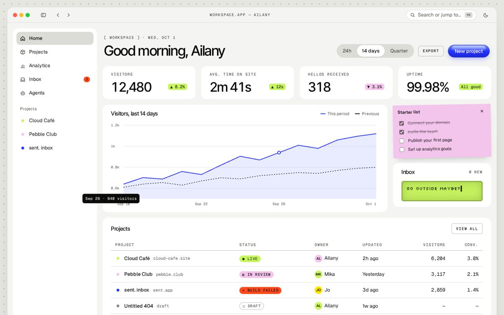
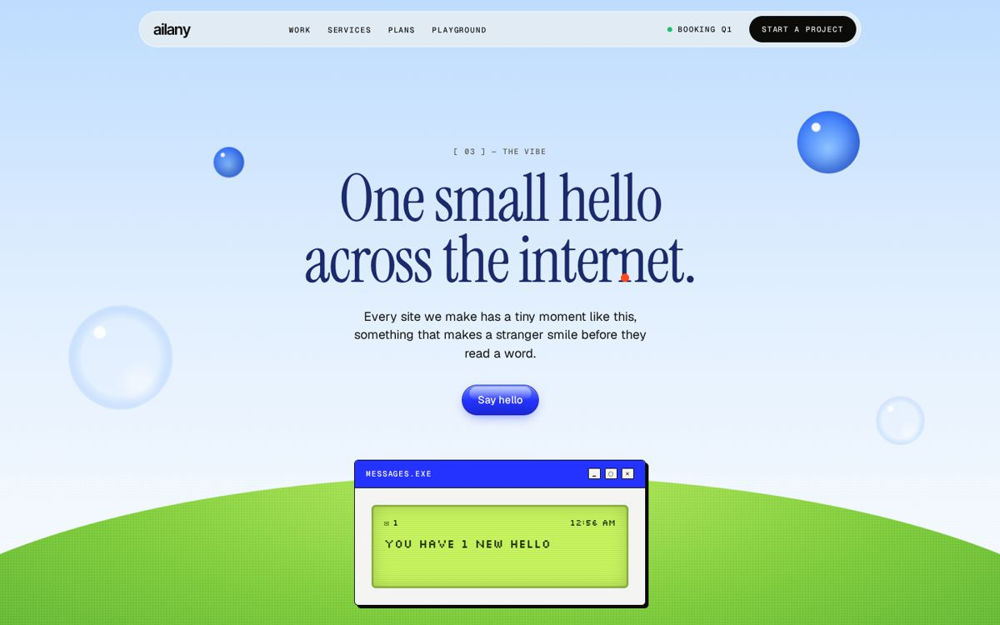
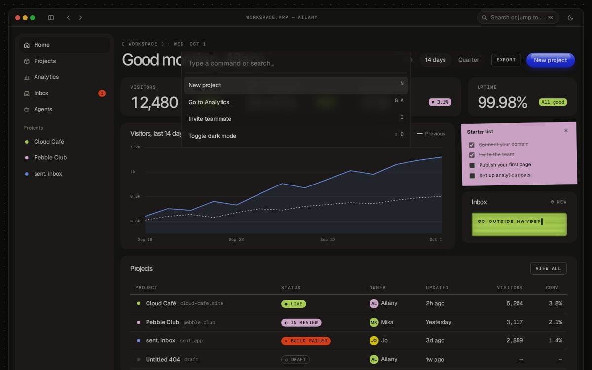

# skills

Personal Claude skills.

## `ailany-design`: modern web with dial-up memories

A house design system Claude follows whenever it builds websites, landing pages, app UI, or
dashboards. It mixes modern studio-site craft (huge tight grotesk type, warm paper, generous
space, flat glass) with early-internet memories (app windows, status dots, LCD screens, pixel
stickers, Aqua gel buttons, sky and soap bubbles), plus a lot of motion:

- **Brand-name preloader:** the wordmark rises, a counter ticks to 100, then it docks into the nav logo
- **Text-scramble hover:** labels dissolve into block glyphs `▀▁▂▃█░▒▓` and resolve
- **3D buddies:** iridescent toys with googly eyes that follow your cursor (three.js)
- **Physics playground:** tags and stickers you can throw around (Matter.js)
- **Flat glass** modals, nav, and toasts; LCD typewriters; soap bubbles; a giant footer wordmark

| Landing | Dashboard |
|---|---|
|  |  |
|  |  |

```
ailany-design/
  SKILL.md                 identity, the ten rules, what to load when
  references/
    tokens.css             colors, type, space, radius, glass, motion (light + dark)
    typography.md          five voices: Inter Tight, Geist, Geist Mono, Instrument Serif, Silkscreen
    components.md          window, glass modal, buttons, sticky note, spec card, sidebar, table…
    motion.md              copy-paste recipes for every animation, reduced-motion safe
    layouts.md             landing-page and dashboard anatomies
    inspiration.md         the sites this came from and what was taken from each
  examples/
    landing.html           full reference landing page (single file)
    dashboard.html         full reference app/dashboard screen (single file)
  scripts/sync_tokens.py   copies tokens.css into the examples after you edit it
  assets/inspiration/      drop your own reference images here
  assets/previews/         screenshots of the examples
```

### Install

**Claude Code (personal):**
```bash
git clone https://github.com/ai-lany/skills.git
mkdir -p ~/.claude/skills && cp -r skills/ailany-design ~/.claude/skills/
```
**One project only:** copy `ailany-design/` into that repo's `.claude/skills/`.

**Claude.ai:** zip the `ailany-design` folder and upload it as a custom skill in your Claude settings.

Then just ask for things: *"build a landing page for my ceramics shop"*, *"make an analytics
dashboard for my newsletter"*, *"restyle this pricing section in my style"*.

### Preview the examples
Open `ailany-design/examples/landing.html` or `dashboard.html` in a browser (they load fonts and
libraries from public CDNs). On the landing page, the preloader runs once per browser session.

### Demos
- `demos/ourspace/`: landing page for a MySpace-inspired social app. A glossy 3D Earth spins
  while pins drop onto cities and tiny profile windows pop open. Built with the skill as a test.
  Open `demos/ourspace/index.html` in a browser.

### Change the style
Edit `references/tokens.css`, then run `python3 ailany-design/scripts/sync_tokens.py` so the
examples and demos pick up the change. Add new references to `references/inspiration.md`.
